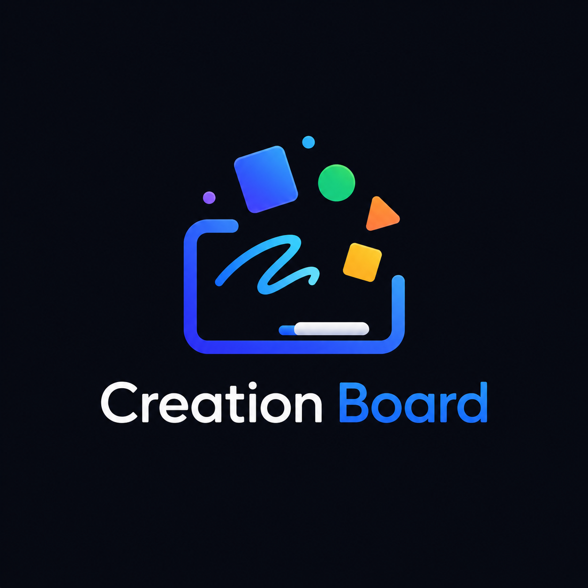
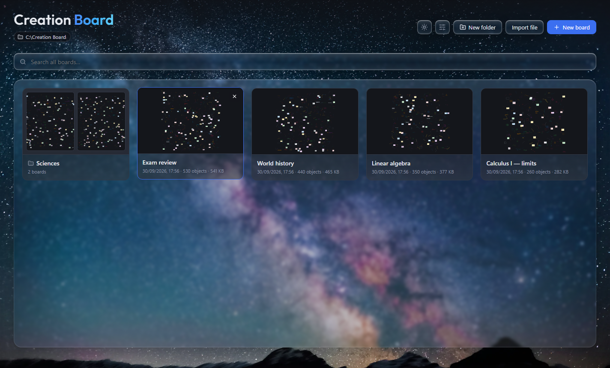
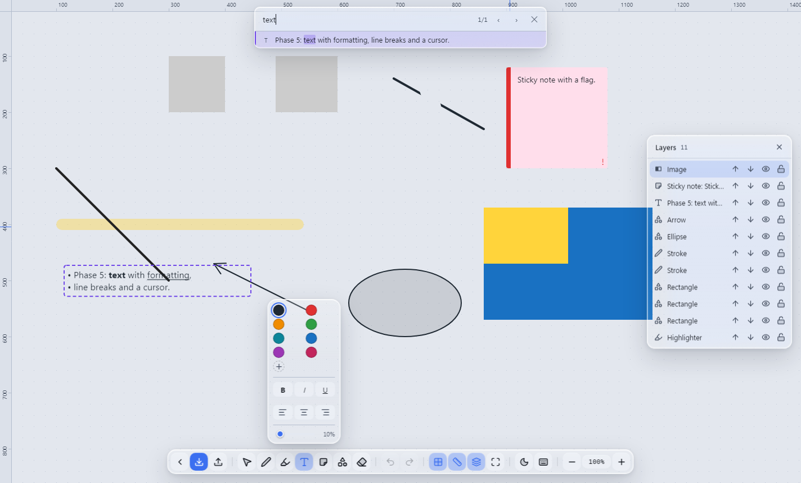

<p align="center"></p>

# Creation Board

[Português](README.md) · **English**

**An infinite whiteboard for studying that runs entirely on your computer.** No login, no
cloud, no server: your boards stay on your disk and never leave it.

It was born from a concrete problem: study notes locked inside other apps, hard to
reorganize and impossible to search properly. That's why **importing comes first**: you bring
in what you already have and keep working here.





> **Version 1.1.0** — a redesigned home screen, folders, animations, Portuguese and English,
> and more privacy for images. See the [release notes](PATCH-NOTES.md#english).

## What it does

- **Imports Microsoft Whiteboard boards** (`.zip` or `.html`): text, ink, images and sticky notes come back editable and in place
- **Infinite canvas** that handles thousands of objects
- **Handwriting**: pen, highlighter and an eraser that erases piece by piece
- **Shapes with snapping**, alignment guides and rulers
- **Formatted text, sticky notes and flags** (important, question, review)
- **Images**: paste, drag and crop — stored without the file's hidden data, such as GPS location
- **Folders** on the home screen, created by dragging one board onto another
- **Finds what you're looking for**:
  - `Ctrl+F` inside a board
  - **including inside images**, through Windows' own text recognition
  - and a search on the home screen that goes through **all boards at once**
- **Exports** PNG, SVG and PDF
- **Saves on its own**, and undoes everything with `Ctrl+Z`
- **Light and dark themes**, **Portuguese and English**

**Nothing leaves your computer:** the app blocks all internet access, and text recognition
uses the Windows engine, without downloading or sending anything.

---

## Install

1. Download `Creation Board-Setup-1.1.0.exe` from the **[Releases](https://github.com/JesseBarros/Creation-Board/releases)** page.
2. Run it. The installer doesn't ask for admin rights, lets you pick the folder, and creates Start menu and desktop shortcuts.

> **Windows will show a blue warning** — *"Windows protected your PC"*. Click **More info**
> and then **Run anyway**. It shows up because the installer **isn't digitally signed** (a
> certificate costs hundreds of dollars a year, which doesn't make sense for an open
> project), not because something is wrong with it.
>
> To check that the file is the published one, compare its SHA-256:
>
> ```
> Get-FileHash "Creation Board-Setup-1.1.0.exe" -Algorithm SHA256
> ```
>
> The result must be `2594A74E7E57BCD02499A331F157CB8717856431BCCA3FD1BFA47322F4A95B44`.

**Coming from 1.0.0?** Install over it. Your boards stay in `C:\Creation Board` and open as
usual. Uninstalling never deletes boards.

## Documentation

| | |
|---|---|
| **[Release notes](PATCH-NOTES.md#english)** | What changed in 1.1.0 |
| **[User guide](docs/USO.en.md)** | Home screen, folders, tools, shortcuts, importing and exporting |
| **[Building and packaging](docs/BUILD.en.md)** | Running in development, verifying and building the installer |
| **[Security](SECURITY.md)** | How the app protects your data, and the 1.1.0 audit (in Portuguese) |
| **[Engineering](ENGENHARIA.md)** | Decisions and measurements the code doesn't explain on its own (in Portuguese) |
| **[Bug log](BUGS.md)** | What went wrong, the cause of each case and the fix (in Portuguese) |

## Running from source

Requires **Windows x64** and **Node.js ≥ 20.18**; there are no native dependencies.

```
npm install
npm run dev
```

Verification, the installer and development variables: [docs/BUILD.en.md](docs/BUILD.en.md).

---

**Jessé Barros** — [github.com/JesseBarros](https://github.com/JesseBarros) · [MIT](LICENSE) license
(the background photos and the title font have their own licenses, noted next to each file).
