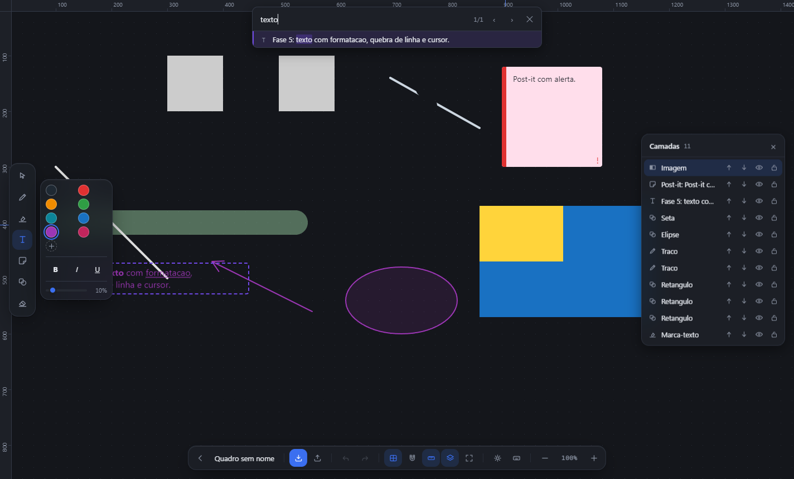
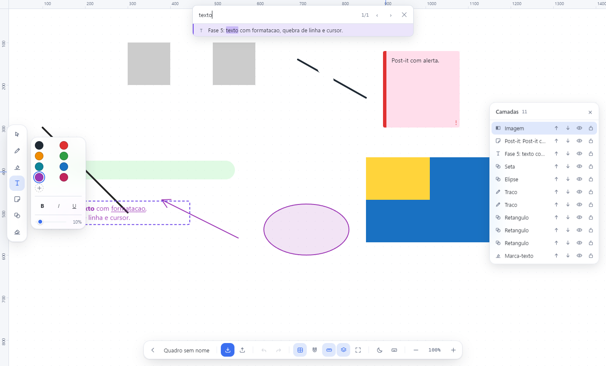

# Creation Board

**Quadro branco infinito para estudar, que roda inteiro na sua máquina.** Sem login, sem
nuvem, sem servidor — os arquivos ficam no seu disco e não saem dele.

Ele nasceu de um problema concreto: resumos presos dentro do Microsoft Whiteboard, difíceis
de reorganizar e impossíveis de pesquisar direito. Por isso a **importação vem primeiro** —
você traz o que já tem e continua o trabalho ali dentro.



<sub>Tema escuro. Ao lado, o mesmo quadro no tema claro — as cores das marcas são adaptadas
na exibição, e o arquivo guarda sempre a cor original.</sub>



## O que ele faz

- **Importa do Microsoft Whiteboard** (`.zip` ou `.html`), com a geometria conferida contra
  o motor de layout do próprio navegador — texto, tinta, imagens e post-its caem no lugar
- **Canvas infinito** que aguenta milhares de objetos, com índice espacial e culling
- **Escreve à mão** — caneta, marca-texto e borracha que apaga por pedaço, não o traço inteiro
- **Formas com encaixe**, guias de alinhamento, grade magnética e réguas
- **Texto rico, post-its e alertas**
- **Imagens** — colar, arrastar do explorador e recortar
- **Acha o que você procura**, e é aqui que ele se diferencia:
  - `Ctrl+F` dentro do quadro
  - **inclusive dentro das imagens**, por OCR — o texto de uma captura de tela vira
    pesquisável
  - e uma busca no menu principal que atravessa **todos os seus quadros de uma vez**
- **Exporta** PNG, SVG e PDF, em ladrilhos quando o quadro não cabe num arquivo só
- **Salva sozinho**, e desfaz tudo com `Ctrl+Z`
- **Tema claro e escuro**, com as cores das marcas adaptadas para continuarem legíveis nos dois

O OCR usa o motor do próprio Windows: **nada é baixado e nada é enviado para lugar nenhum.**

---

## Documentação

| | |
|---|---|
| **[Guia de uso](docs/USO.md)** | Controles, ferramentas, importar, exportar, temas |
| **[Compilar e empacotar](docs/BUILD.md)** | Build de produção, instalador `.exe`, armadilhas do Windows |
| **[Segurança](SECURITY.md)** | Modelo de ameaça, isolamento, integridade dos dados e cadeia de suprimentos |
| **[Engenharia](ENGENHARIA.md)** | As decisões que o código não explica sozinho, e como verificá-lo |
| **[Registro de bugs](BUGS.md)** | O que deu errado, a causa de cada caso e a correção |

Os dois últimos são o registro real do desenvolvimento — incluindo as **hipóteses que se
provaram erradas**, e a medição que derrubou cada uma.

---

## Instalar

Baixe o instalador na página de **[Releases](https://github.com/JesseBarros/Creation-Board/releases)**
(`Creation Board-Setup-1.0.0.exe`, 78 MB) e execute.

> **O Windows vai mostrar um aviso azul** — *"O Windows protegeu o computador"*. Clique em
> **Mais informações** e depois em **Executar assim mesmo**.
>
> Ele aparece porque o instalador **não tem assinatura digital**, e não porque haja algo
> errado com o programa. Um certificado de assinatura custa algumas centenas de dólares por
> ano, o que não se justifica num projeto aberto. Para conferir que o arquivo é o mesmo que
> foi publicado, compare o SHA-256 com o que está na página do release:
>
> ```
> Get-FileHash "Creation Board-Setup-1.0.0.exe" -Algorithm SHA256
> ```

A instalação **não pede privilégio de administrador**, deixa escolher a pasta e cria atalhos
no menu Iniciar e na área de trabalho. Desinstalar não apaga seus quadros.

## Rodar sem instalar

```
npm install
npm run dev
```

A janela abre direto, sem instalador e sem deixar nada no sistema. É assim que se usa o app
durante o desenvolvimento. Fechar a janela encerra tudo; nada fica registrado no Windows.

## Requisitos

- **Node.js ≥ 20.18** — testado em 20.18.3
- **Windows x64**
- Nada mais. Sem Python, sem Visual Studio Build Tools (não há dependências nativas).

## Instalação das dependências

```
npm install
```

## Desenvolvimento

```
npm run dev
```

Sobe o Vite com HMR e abre a janela do Electron com o DevTools destacado.
Editar arquivos em `src/renderer/` recarrega na hora; editar `src/main/` ou
`src/preload/` reinicia o processo principal.

## Como ele foi construído

Em fases, cada uma entregando algo usável de ponta a ponta. **A ordem diverge do que seria
natural, e isso foi a primeira decisão do projeto:** importar e manipular vieram *antes* de
desenhar, porque o objetivo era migrar resumos que já existiam. Uma caneta ótima não serve
para migrar nada.

| Fase | O que entregou |
|---|---|
| 0 | Setup, janela, instalador `.exe` validado |
| 1 | Canvas infinito, modelo de dados, índice espacial, culling, painel `F3` |
| 1.5 | Lobby com miniaturas, salvar `.wbd`, tela de atalhos |
| 2 | Importação do Whiteboard, conferida contra o motor de layout do navegador |
| 3 | Seleção: mover, redimensionar, girar, duplicar, camadas, undo/redo |
| 4 | Caneta, marca-texto, borracha, cores e espessura |
| 4.5 | Formas, encaixe com guias, grade magnética, réguas |
| 5 | Texto rico, post-its e alertas |
| 5.5 | Borracha que apaga por pedaço |
| 6 | Busca `Ctrl+F` |
| 7 | Imagens: colar, arrastar e recortar |
| 8 | Exportar PNG/SVG/PDF e autosave |
| 9 | Polimento de interface, temas e build final |
| 7.5 | OCR: o `Ctrl+F` acha texto dentro das imagens |
| — | Busca cruzando toda a biblioteca de quadros |

**As duas últimas não estavam no plano.** A 5.5 também não. Todas apareceram de usar o que
estava pronto e perceber o que faltava — e são, hoje, as partes mais úteis do app. O
[ENGENHARIA.md](ENGENHARIA.md) registra as decisões e as medições que sustentam cada uma.

---

## Autor

**Jessé Barros** — [github.com/JesseBarros](https://github.com/JesseBarros)

Licenciado sob [MIT](LICENSE).