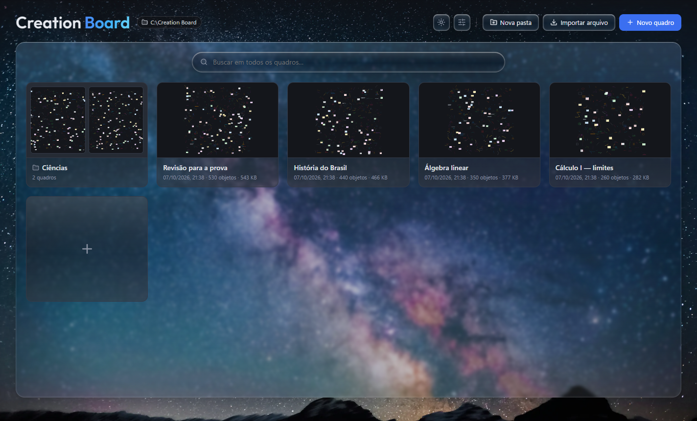
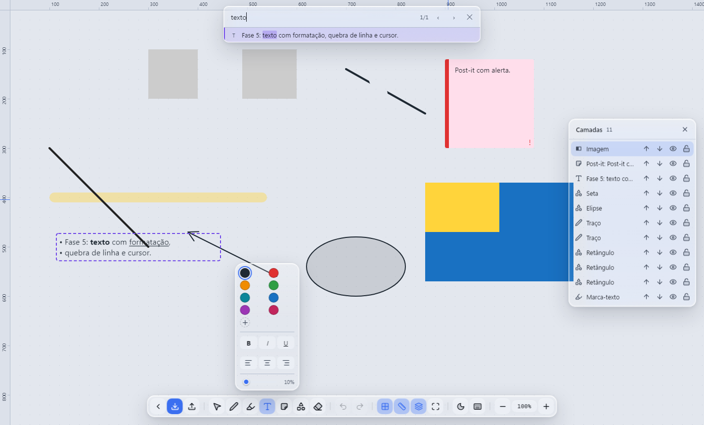

<p align="center"></p>

# Creation Board

**Português** · [English](README.en.md)


Ele nasceu de um problema concreto: resumos presos dentro de outros aplicativos, difíceis de
reorganizar e impossíveis de pesquisar direito. Por isso a **importação vem primeiro**: você
traz o que já tem e continua o trabalho aqui.





> **Versão 1.1.0** — menu principal repaginado, pastas, animações, português e inglês, e
> mais privacidade nas imagens. Veja as [notas da versão](PATCH-NOTES.md).

## O que ele faz

- **Importa quadros do Microsoft Whiteboard** (`.zip` ou `.html`): texto, tinta, imagens e post-its voltam editáveis e no lugar
- **Canvas infinito** que aguenta milhares de objetos
- **Escreve à mão**: caneta, marca-texto e borracha que apaga por pedaço
- **Formas com encaixe**, guias de alinhamento e réguas
- **Texto formatado, post-its e alertas** (importante, dúvida, revisar)
- **Imagens**: colar, arrastar e cortar — guardadas sem os dados escondidos do arquivo, como a localização de GPS
- **Pastas** no menu principal, criadas arrastando um quadro sobre outro
- **Acha o que você procura**:
  - `Ctrl+F` dentro do quadro
  - **inclusive dentro das imagens**, pelo reconhecimento de texto do próprio Windows
  - e uma busca no menu principal que atravessa **todos os quadros de uma vez**
- **Exporta** PNG, SVG e PDF
- **Salva sozinho**, e desfaz tudo com `Ctrl+Z`
- **Tema claro e escuro**, **português e inglês**

**Nada sai do seu computador:** o app bloqueia qualquer acesso à internet, e o reconhecimento
de texto usa o motor do Windows, sem baixar nem enviar nada.

---

## Instalar

1. Baixe `Creation Board-Setup-1.1.0.exe` na página de **[Releases](https://github.com/JesseBarros/Creation-Board/releases)**.
2. Execute. O instalador não pede administrador, deixa escolher a pasta e cria atalhos no menu Iniciar e na Área de Trabalho.

> **O Windows vai mostrar um aviso azul** — *"O Windows protegeu o computador"*. Clique em
> **Mais informações** e depois em **Executar assim mesmo**. O aviso aparece porque o
> instalador **não tem assinatura digital** (um certificado custa centenas de dólares por ano,
> o que não se justifica num projeto aberto), e não porque haja algo errado com ele.
>
> Para conferir que o arquivo é o publicado, compare o SHA-256:
>
> ```
> Get-FileHash "Creation Board-Setup-1.1.0.exe" -Algorithm SHA256
> ```
>
> O resultado tem de ser `074E089EF9BC04AB13E8A711E996D28295C1E7344235DDAD8F461698A08B588F`.

**Vindo da 1.0.0?** Instale por cima. Seus quadros continuam em `C:\Creation Board` e abrem
normalmente. Desinstalar nunca apaga quadros.

## Documentação

| | |
|---|---|
| **[Notas da versão](PATCH-NOTES.md)** | O que mudou na 1.1.0 |
| **[Guia de uso](docs/USO.md)** | Menu principal, pastas, ferramentas, atalhos, importar e exportar |
| **[Compilar e empacotar](docs/BUILD.md)** | Rodar em desenvolvimento, verificar e gerar o instalador |
| **[Segurança](SECURITY.md)** | Como o app protege os seus dados, e a auditoria da 1.1.0 |
| **[Engenharia](ENGENHARIA.md)** | Decisões e medições que o código não explica sozinho |
| **[Registro de bugs](BUGS.md)** | O que deu errado, a causa de cada caso e a correção |

## Rodar a partir do código

Requer **Windows x64** e **Node.js ≥ 20.18**; não há dependência nativa.

```
npm install
npm run dev
```

Verificação, instalador e variáveis de desenvolvimento: [docs/BUILD.md](docs/BUILD.md).

---

**Jessé Barros** — [github.com/JesseBarros](https://github.com/JesseBarros) · Licença [MIT](LICENSE)
(as fotos de fundo e a fonte do título têm licenças próprias, indicadas junto de cada arquivo).
